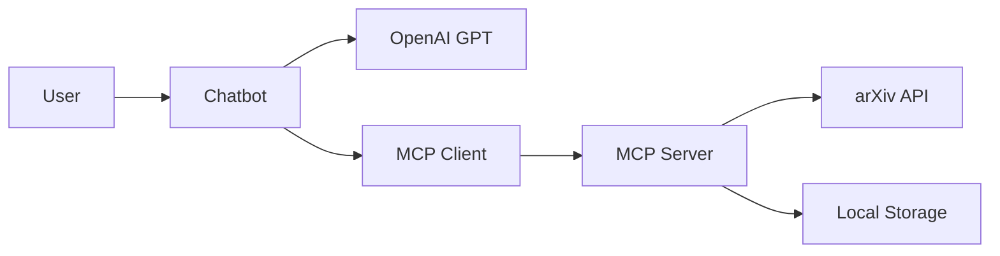

# 🚀 Course-MCP

> **Model Context Protocol (MCP) Fundamentals** - Connect LLMs with external tools

[](https://python.org)
[](https://openai.com)
[](https://modelcontextprotocol.io)

## 🏗️ Interaction Diagram



## 📦 Components

| File | Description |
|------|-------------|
| `mcp_server.py` | MCP server with arXiv tools |
| `mcp_client.py` | Test client |
| `mcp_chatbot.py` | OpenAI + MCP chatbot |

## ⚡ Setup

```bash
# 1. Install dependencies
pip install openai arxiv mcp fastmcp nest-asyncio

# 2. Set API key
export OPENAI_API_KEY="your-api-key"

# 3. Run
python mcp_chatbot.py
```

## 🛠️ MCP Tools

### `search_papers(topic, max_results=5)`
Search papers on arXiv by topic

### `extract_info(paper_id)`
Extract detailed paper information

## 💬 Usage Example

```
Your query: Search papers about machine learning

⚡ Calling search_papers with args: {"topic": "machine learning", "max_results": 3}
📄 Result: ['2401.12345', '2401.67890', '2401.54321']

🤖 Assistant: Found 3 papers about machine learning. Want details on any?

Your query: Details of the first one

⚡ Calling extract_info with args: {"paper_id": "2401.12345"}
📄 Result: {"title": "Deep Learning Advances", "authors": ["Smith, J."], ...}

🤖 Assistant: The paper "Deep Learning Advances" by Smith, J. presents...
```

## 🚀 Usage

### Server
```bash
python mcp_server.py
```

### Test client
```bash
python mcp_client.py
```

### Interactive chatbot
```bash
python mcp_chatbot.py
```

## 📁 Structure

```
Course-MCP/
├── mcp_server.py     # MCP server
├── mcp_client.py     # Test client
├── mcp_chatbot.py    # Chatbot
└── papers/           # Local data
```

## 🧠 MCP Concepts

- **Server**: Exposes tools (`@mcp.tool()`)
- **Client**: Consumes tools via stdio
- **Tools**: Functions the LLM can execute
- **Protocol**: Standard MCP communication

## 🔧 Troubleshooting

```bash
# API key error
export OPENAI_API_KEY="your-key"

# Module error
pip install mcp fastmcp

# File error
cd Course-MCP && python mcp_chatbot.py
```

## 📚 Resources

- [MCP Docs](https://modelcontextprotocol.io)
- [GitHub MCP](https://github.com/github/github-mcp-server)
- [Awesome MCP](https://github.com/punkpeye/awesome-mcp-servers)

